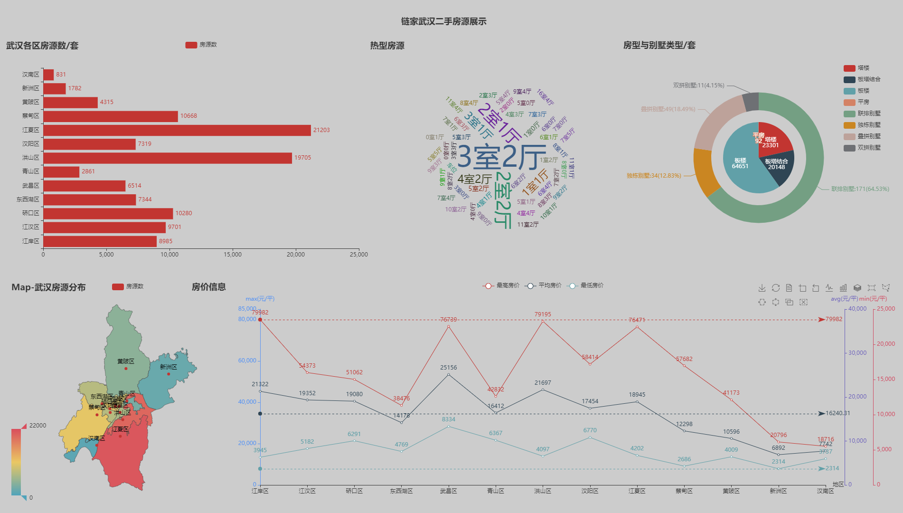

# 学习记录
基于python开发
交流学习 

学习交流qq：1874369378

# 免责声明：此代码仅学习使用，请勿用于商业用途，如拿去非法使用与本人无关！

# 目录

1. [spider -- 京东](https://github.com/ywygblz/spider/blob/main/README.md#%E4%B8%80spider----京东)
2. [spider -- 天眼查滑动验证码](https://github.com/ywygblz/spider/blob/main/README.md#%E4%BA%8Cspider----天眼查滑动验证码)
3. [spider -- 链家二手房源爬取存入mysql数据库](#%E4%B8%89spider----链家二手房源爬取存入mysql数据库)
4. [spider -- 网易云评论 -- js逆向](#%E5%9B%9Bspider----网易云评论----js逆向)
5. [spider -- 豆瓣读书 -- js逆向](#%E4%BA%94spider----豆瓣读书----js逆向)
6. [django -- 文件上传 -- 对称加密](#六django----文件上传----对称加密)
7. [tk可视化界面 -- 飞卢中文网 -- 便捷工具](#七tk可视化界面--飞卢中文网--便捷工具)


# [一、spider -- 京东](https://github.com/ywygblz/spider/tree/main/1-%E4%BA%AC%E4%B8%9C)

### 1、通过商家id爬取商品数据及评论

> 运行main()开始爬取

> 传入evaluat_switch=False，可开启爬取评论

### 2、通过关键字爬取商品数据及评论

>  运行run_search_goods()开始爬取

> 获取id后可值传入get_goods_evaluat(productId: str)函数获取评论


# [二、spider -- 天眼查滑动验证码](https://github.com/ywygblz/spider/tree/main/2-%E5%A4%A9%E7%9C%BC%E6%9F%A5%E6%BB%91%E5%8A%A8%E9%AA%8C%E8%AF%81%E7%A0%81)

## 基于自动化测试功具selenium及cv2中的模版对比实现滑动验证码破解

## 需要提前安装selenium自动化测试环境及chromedriver 下载

### 实现效果


# [三、spider -- 链家二手房源爬取存入mysql数据库](/3-%E9%93%BE%E5%AE%B6/)

## 1.以 湖北武汉 为例，先拿到所有区的名字和url

如下图（只显示部分）


## 2.新建数据表
```MySql
/*
['104108454851', '中建文华星城-文化大道', '113.03平米', '158万元', '13978元/平', '3室2厅', '南北', '简装', '高楼层(共34层)', '2016年建', '板塔结合']
*/
create table lianjia_wh_used_2(
id int primary key not null auto_increment,
url_id varchar(15) not null,
region varchar(5) not null,
name varchar(20) not null,
area varchar(10),
money varchar(7),
price varchar(10),
trait_1 varchar(10),
trait_2 varchar(10),
trait_3 varchar(10),
trait_4 varchar(10),
trait_5 varchar(10),
trait_6 varchar(10),
trait_7 varchar(10)
);
```


## 3.运行get_data_ls方法即可
```Python
url_prefix = 'https://wh.lianjia.com/ershoufang/baibuting/'
district = '江岸'
get_data_ls(url_prefix=url_prefix, district=district)
```

## 4.数据分析
房源数据（10万条中的部分）


### [1.直方图(点击查看)](https://ywygblz.github.io/spider/3-链家/数据图/1-直方图.html)<br>
[](https://ywygblz.github.io/spider/3-链家/数据图/1-直方图.html)<br>
### [2.直方图(点击查看)](https://ywygblz.github.io/spider/3-链家/数据图/2-圆饼图.html)<br>
[](https://ywygblz.github.io/spider/3-链家/数据图/2-圆饼图.html)<br>
### [3.折线图(点击查看)](https://ywygblz.github.io/spider/3-链家/数据图/3-折线图.html)<br>
[](https://ywygblz.github.io/spider/3-链家/数据图/3-折线图.html)<br>
### [4.词云图(点击查看)](https://ywygblz.github.io/spider/3-链家/数据图/4-词云图.html)<br>
[](https://ywygblz.github.io/spider/3-链家/数据图/4-词云图.html)<br>
### [5.武汉市地图(点击查看)](https://ywygblz.github.io/spider/3-链家/数据图/5-武汉市地图.html)<br>
[](https://ywygblz.github.io/spider/3-链家/数据图/5-武汉市地图.html)<br>
### [6.大屏展示图(点击查看)](https://ywygblz.github.io/spider/3-链家/数据图/6-大屏展示图.html)<br>
[](https://ywygblz.github.io/spider/3-链家/数据图/6-大屏展示图.html)<br>

# [四、spider -- 网易云评论 -- js逆向](4-网易云评论)
### 1.主要搞定这两个参数

### 2.扣完后验证
```javascript
//会用到这个包
var CryptoJS = require("crypto-js");
```

### 3.在用python引用下结果在请求就有结果了


# [五、spider -- 豆瓣读书 -- js逆向](5-豆瓣)
### 1.需要破解加密的字符串

### 2.首次会得到一个没有序列化的数组

### 3.在Rt()(t)函数运行后会得到一个序列化的数组

### 4.在用python解析一下得到的结果
#### 引用js文件的结果可能有编码的问题，这里使用cmd重定向的方式保存


# [六、django -- 文件上传 -- 对称加密](6-文件上传-django)
### 需求

### 登陆页

### 主页


# 七、tk可视化界面--飞卢中文网--便捷工具
> 针对飞卢中文网帐户上的小说进行批量处理

### 主要使用技术
> 1.数据抓取(爬虫)\
> 2.可视化模块tkinter\
> 3.可视化美化库ttkbootstrap\
> 4.多线程(防止主界面假死)\
> 5.软件打包pyinstaller
1. 主界面和副页面

2. 运行结果

3. 报错提示


# [回到目录](#目录)